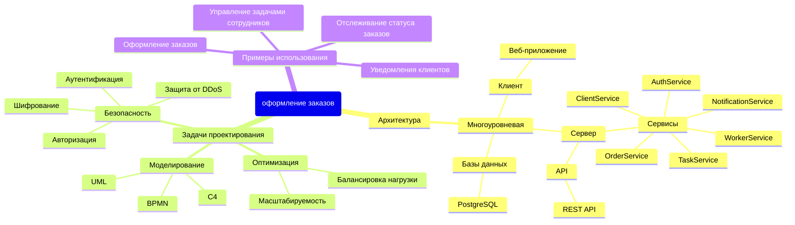
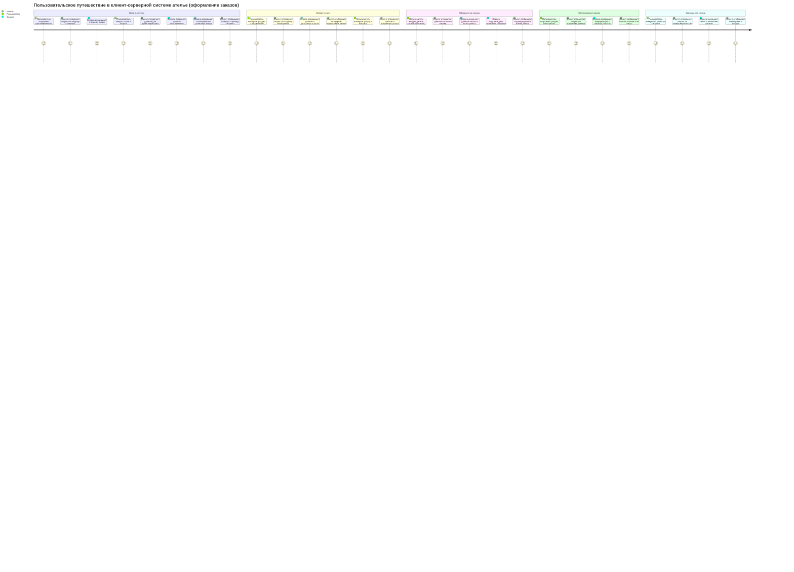
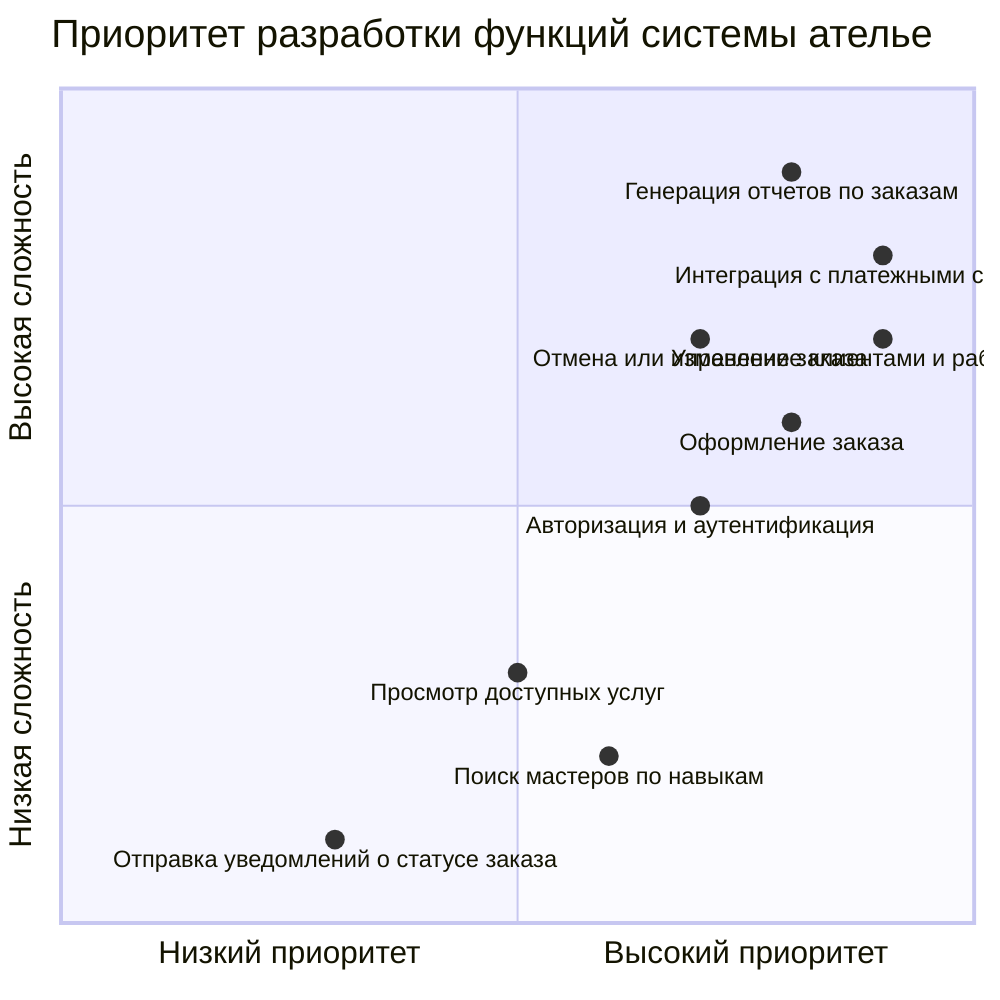
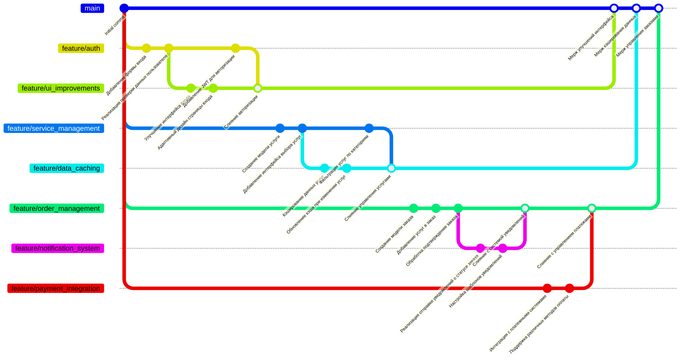

# pkss_budkov

Mindmap (Ментальная карта) cтруктурирует ключевые аспекты проектирования системы.
В клиент-серверной системе ателье карта охватывает архитектуру (клиент, сервер, базы данных), задачи проектирования (масштабируемость, безопасность) и примеры использования (оформление заказов, управление услугами, отчетность).
Используется для обсуждения требований и планирования разработки.

Journey Map (Карта пользовательского пути)
Показывает пошаговый процесс взаимодействия пользователя с системой.
Например, пользователь входит в систему, выбирает услуги, создает заказ, подтверждает его, получает уведомления и завершает сеанс.
Помогает понять, как пользователи будут использовать систему и где могут возникнуть сложности.

Quadrant Chart (Диаграмма приоритетов)
Представляет функции системы по их приоритету и сложности реализации.
Высокий приоритет имеют задачи, такие как создание заказов и интеграция с платежными системами.
Помогает расставить приоритеты в разработке и сосредоточиться на наиболее важных функциях.

GitGraph (Диаграмма веток Git)
Отображает историю разработки системы, включая ветки, коммиты и слияния.
Например, ветка feature/order_management охватывает создание модели заказов, добавление услуг в заказ и подтверждение заказа.
Используется для управления версионностью и контроля разработки.

